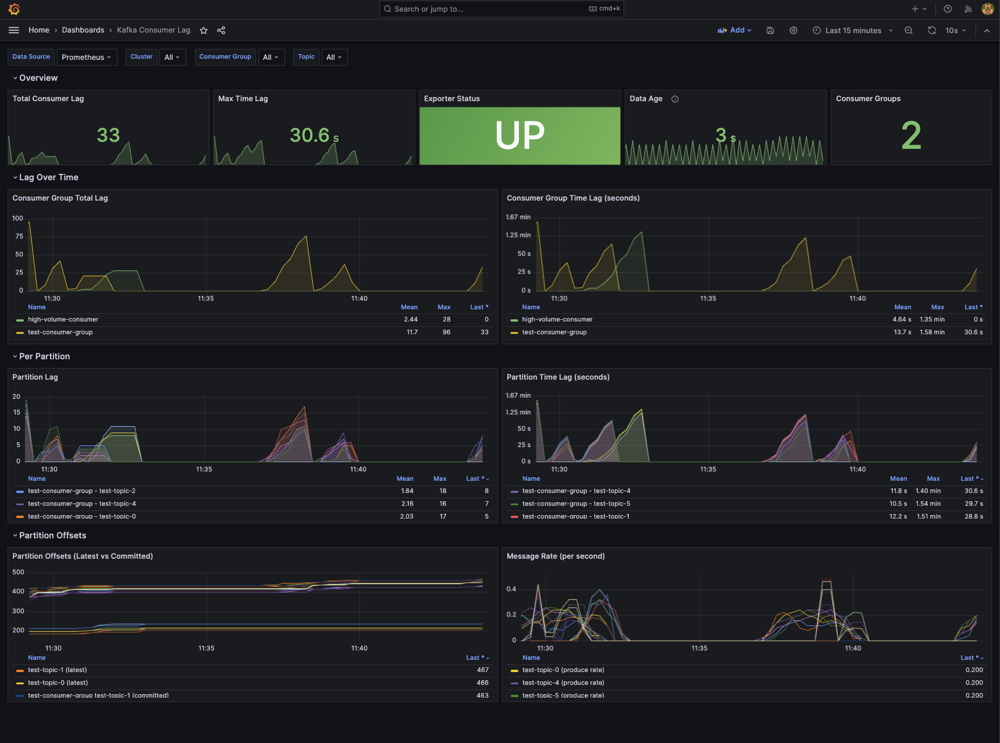

<p align="center">
  
  
  
  
</p>

# klag-exporter

A high-performance Apache Kafka® consumer group lag exporter written in Rust. Calculates both **offset lag** and **time lag** (latency in seconds) with accurate timestamp-based measurements.

<p align="center">
  
</p>

## Features

- **Accurate Time Lag Calculation** — Directly reads message timestamps from Kafka® partitions instead of interpolating from lookup tables
- **Compaction & Retention Detection** — Automatically detects when log compaction or retention deletion may affect time lag accuracy
- **Data Loss Detection** — Detects and quantifies message loss when consumers fall behind retention, with metrics for prevention alerts
- **Dual Export Support** — Native Prometheus HTTP endpoint (`/metrics`) and OpenTelemetry OTLP export
- **Non-blocking Scrapes** — Continuous background collection with instant metric reads (no Kafka® calls during Prometheus scrapes)
- **Multi-cluster Support** — Monitor multiple Kafka® clusters with independent collection loops and failure isolation
- **Flexible Filtering** — Regex-based whitelist/blacklist for consumer groups and topics
- **Configurable Granularity** — Topic-level (reduced cardinality) or partition-level metrics
- **Custom Labels** — Add environment, datacenter, or any custom labels to all metrics
- **Full Authentication Support** — SASL/PLAIN, SASL/SCRAM, SSL/TLS, and Kerberos via librdkafka
- **Production Ready** — Health (`/health`) and readiness (`/ready`) endpoints for Kubernetes deployments
- **High Availability** — Optional Kubernetes leader election for active-passive failover (see [HA Guide](docs/high-availability.md))
- **Resource Efficient** — Written in Rust with async/await, minimal memory footprint, and bounded concurrency

## Why klag-exporter?

### Comparison with Existing Solutions

| Feature | klag-exporter | kafka-lag-exporter | KMinion |
|---------|---------------|-------------------|---------|
| **Language** | Rust | Scala (JVM) | Go |
| **Time Lag** | Direct timestamp reading | Interpolation from lookup table | Offset-only (requires PromQL) |
| **Idle Producer Handling** | Shows actual message age | Shows 0 (interpolation fails) | N/A |
| **Memory Usage** | ~20-50 MB | ~200-500 MB (JVM) | ~50-100 MB |
| **Startup Time** | < 1 second | 5-15 seconds (JVM warmup) | < 1 second |
| **OpenTelemetry** | Native OTLP | No | No |
| **Blocking Scrapes** | No | No | Yes |

### Time Lag Accuracy

**Problem with interpolation (kafka-lag-exporter):**
- Builds a lookup table of (offset, timestamp) pairs over time
- Interpolates to estimate lag — breaks when producers stop sending
- Shows 0 lag incorrectly for idle topics
- Requires many poll cycles to build accurate tables

**Our approach (targeted timestamp sampling):**
- Seeks directly to the consumer group's committed offset
- Reads actual message timestamp — always accurate
- Handles idle producers correctly (shows true message age)
- TTL-cached to prevent excessive broker load

### Compaction and Retention Limitations

Both **log compaction** (`cleanup.policy=compact`) and **retention-based deletion** can affect time lag accuracy:

| Scenario | Effect on Offset Lag | Effect on Time Lag |
|----------|---------------------|-------------------|
| **Compaction** | Inflated (some offsets no longer exist) | Understated (reads newer message) |
| **Retention** | Inflated (deleted messages still counted) | Understated (reads newer message) |

**How it happens:** When a consumer's committed offset points to a deleted message, Kafka returns the next available message instead. This message has a later timestamp, making time lag appear smaller than reality.

**Detection:** klag-exporter automatically detects these conditions and exposes:
- `compaction_detected` and `data_loss_detected` labels on `kafka_consumergroup_group_lag_seconds`
- `kafka_lag_exporter_compaction_detected_total` and `kafka_lag_exporter_data_loss_partitions_total` counters

**Recommendations:**
- For affected partitions, rely more on offset lag than time lag
- Alert on `kafka_lag_exporter_compaction_detected_total > 0` or `kafka_lag_exporter_data_loss_partitions_total > 0`
- Investigate if detection counts are high — may indicate very lagging consumers or aggressive compaction/retention settings

See [docs/compaction-detection.md](docs/compaction-detection.md) for detailed technical explanation.

### Data Loss Detection

When a consumer falls too far behind, Kafka® retention policies may delete messages before they're processed. klag-exporter detects and quantifies this:

**How it works:** Data loss occurs when a consumer group's committed offset falls below the partition's low watermark (earliest available offset). This means messages were deleted by retention before the consumer could process them.

**Understanding `lag_retention_ratio`:**

This metric shows what percentage of the available retention window is occupied by consumer lag:

```
                    current_lag
lag_retention_ratio = ─────────────────── × 100
                    retention_window

where:
  retention_window = high_watermark - low_watermark  (total offsets in partition)
  current_lag      = high_watermark - committed_offset
```

| Ratio | Meaning |
|-------|---------|
| 0% | Consumer is caught up (no lag) |
| 50% | Consumer lag equals half the retention window |
| 100% | Consumer is at the deletion boundary — next retention cycle may cause data loss |
| >100% | Data loss has already occurred |

Example: If a partition has offsets 1000-2000 (retention window = 1000) and consumer is at offset 1200:
- current_lag = 2000 - 1200 = 800
- lag_retention_ratio = (800 / 1000) × 100 = **80%** — consumer is 80% of the way to data loss

**Metrics provided:**

| Metric | Description | Example Use |
|--------|-------------|-------------|
| `kafka_consumergroup_group_messages_lost` | Count of messages deleted before processing | Alert when > 0 |
| `kafka_consumergroup_group_retention_margin` | Distance to deletion boundary | Alert when approaching 0 |
| `kafka_consumergroup_group_lag_retention_ratio` | Lag as % of retention window | Alert when > 80% |
| `data_loss_detected` label | Boolean flag on lag metrics | Filter affected partitions |

**Prevention strategy:**
- Set alerts on `retention_margin` approaching zero (e.g., < 10% of typical lag)
- Monitor `lag_retention_ratio` — values approaching 100% indicate imminent data loss
- Use `messages_lost > 0` for post-incident detection
- Consider increasing topic retention or scaling consumers when ratios are high

**Example Prometheus alerts:**

```yaml
# Imminent data loss warning
- alert: KafkaConsumerNearDataLoss
  expr: kafka_consumergroup_group_lag_retention_ratio > 80
  for: 5m
  labels:
    severity: warning
  annotations:
    summary: "Consumer {{ $labels.group }} approaching retention boundary"

# Data loss occurred
- alert: KafkaConsumerDataLoss
  expr: kafka_consumergroup_group_messages_lost > 0
  labels:
    severity: critical
  annotations:
    summary: "Consumer {{ $labels.group }} lost {{ $value }} messages"
```

## Quick Start

### Using Helm (Kubernetes)

```bash
# Install from OCI registry
helm install klag-exporter oci://ghcr.io/softwaremill/helm/klag-exporter \
  --set config.clusters[0].bootstrap_servers="kafka:9092" \
  --set config.clusters[0].name="my-cluster" \
  -n kafka --create-namespace

# Or with custom values file
helm install klag-exporter oci://ghcr.io/softwaremill/helm/klag-exporter \
  -f values.yaml \
  -n kafka --create-namespace
```

See [`helm/klag-exporter/Readme.md`](helm/klag-exporter/Readme.md) for detailed Helm chart documentation.

### Using Docker

```bash
docker run -d \
  -p 8000:8000 \
  -v $(pwd)/config.toml:/etc/klag-exporter/config.toml \
  klag-exporter:latest \
  --config /etc/klag-exporter/config.toml
```

### Using Binary

```bash
# Build from source
cargo build --release

# Run with config file
./target/release/klag-exporter --config config.toml

# Run with debug logging
./target/release/klag-exporter -c config.toml -l debug
```

### Using Docker Compose (Demo Stack)

A complete demo environment with Kafka®, Prometheus, and Grafana is available in the `test-stack/` directory:

```bash
cd test-stack
docker-compose up -d --build

# Access points:
# - Grafana:       http://localhost:3000 (admin/admin)
# - Prometheus:    http://localhost:9090
# - klag-exporter: http://localhost:8000/metrics
# - Kafka UI:      http://localhost:8080
```

## Configuration

Create a `config.toml` file:

```toml
[exporter]
poll_interval = "30s"
http_port = 8000
http_host = "0.0.0.0"
granularity = "partition"  # "topic" or "partition"

[exporter.timestamp_sampling]
enabled = true
cache_ttl = "60s"
max_concurrent_fetches = 10

[exporter.otel]
enabled = false
endpoint = "http://localhost:4317"
export_interval = "60s"

[[clusters]]
name = "production"
bootstrap_servers = "kafka1:9092,kafka2:9092"
group_whitelist = [".*"]
group_blacklist = []
topic_whitelist = [".*"]
topic_blacklist = ["__.*"]  # Exclude internal topics

[clusters.consumer_properties]
"security.protocol" = "SASL_SSL"
"sasl.mechanism" = "PLAIN"
"sasl.username" = "${KAFKA_USER}"
"sasl.password" = "${KAFKA_PASSWORD}"

[clusters.labels]
environment = "production"
datacenter = "us-east-1"
```

### Environment Variable Substitution

Use `${VAR_NAME}` syntax in config values. The exporter will substitute with environment variable values at startup.

## Metrics

### Partition Offset Metrics

| Metric | Labels | Description |
|--------|--------|-------------|
| `kafka_partition_latest_offset` | cluster_name, topic, partition | High watermark offset |
| `kafka_partition_earliest_offset` | cluster_name, topic, partition | Low watermark offset |

### Consumer Group Metrics (Partition Level)

| Metric | Labels | Description |
|--------|--------|-------------|
| `kafka_consumergroup_group_offset` | cluster_name, group, topic, partition, member_host, consumer_id, client_id | Committed offset |
| `kafka_consumergroup_group_lag` | cluster_name, group, topic, partition, member_host, consumer_id, client_id | Offset lag |
| `kafka_consumergroup_group_lag_seconds` | cluster_name, group, topic, partition, member_host, consumer_id, client_id, compaction_detected, data_loss_detected | Time lag in seconds |

### Data Loss Detection Metrics

| Metric | Labels | Description |
|--------|--------|-------------|
| `kafka_consumergroup_group_messages_lost` | cluster_name, group, topic, partition, member_host, consumer_id, client_id | Messages deleted by retention before consumer processed them |
| `kafka_consumergroup_group_retention_margin` | cluster_name, group, topic, partition, member_host, consumer_id, client_id | Offset distance to deletion boundary (negative = data loss) |
| `kafka_consumergroup_group_lag_retention_ratio` | cluster_name, group, topic, partition, member_host, consumer_id, client_id | Percentage of retention window occupied by lag (>100 = data loss) |

### Consumer Group Aggregate Metrics

| Metric | Labels | Description |
|--------|--------|-------------|
| `kafka_consumergroup_group_max_lag` | cluster_name, group | Max offset lag across partitions |
| `kafka_consumergroup_group_max_lag_seconds` | cluster_name, group | Max time lag across partitions |
| `kafka_consumergroup_group_sum_lag` | cluster_name, group | Sum of offset lag |
| `kafka_consumergroup_group_topic_sum_lag` | cluster_name, group, topic | Sum of offset lag per topic |

### Operational Metrics

| Metric | Labels | Description |
|--------|--------|-------------|
| `kafka_consumergroup_poll_time_ms` | cluster_name | Time to poll all offsets |
| `kafka_lag_exporter_scrape_duration_seconds` | cluster_name | Collection cycle duration |
| `kafka_lag_exporter_up` | — | 1 if healthy, 0 otherwise |
| `kafka_lag_exporter_compaction_detected_total` | cluster_name | Partitions where log compaction was detected |
| `kafka_lag_exporter_data_loss_partitions_total` | cluster_name | Partitions where data loss occurred (committed offset < low watermark) |

## HTTP Endpoints

| Endpoint | Description |
|----------|-------------|
| `GET /metrics` | Prometheus metrics |
| `GET /health` | Liveness probe (always 200 if running) |
| `GET /ready` | Readiness probe (200 when metrics available, 503 if standby in HA mode) |
| `GET /leader` | Leadership status JSON (`{"is_leader": true/false}`) |
| `GET /` | Basic info page |

## Architecture

```
┌─────────────────────────────────────────────────────────────────────────────┐
│                              Main Application                                │
│  ┌──────────────┐  ┌──────────────────┐  ┌──────────────────────────────┐  │
│  │   Config     │  │   HTTP Server    │  │      Metrics Registry        │  │
│  │   Loader     │  │  (Prometheus +   │  │   (In-memory Gauge Store)    │  │
│  │              │  │   Health)        │  │                              │  │
│  └──────────────┘  └──────────────────┘  └──────────────────────────────┘  │
│                                                         ▲                   │
│  ┌──────────────────────────────────────────────────────┴────────────────┐  │
│  │                      Cluster Manager (per cluster)                    │  │
│  │  ┌─────────────────┐  ┌─────────────────┐  ┌─────────────────────┐   │  │
│  │  │  Offset         │  │  Timestamp      │  │  Metrics            │   │  │
│  │  │  Collector      │  │  Sampler        │  │  Calculator         │   │  │
│  │  │  (Admin API)    │  │  (Consumer)     │  │                     │   │  │
│  │  └─────────────────┘  └─────────────────┘  └─────────────────────┘   │  │
│  └───────────────────────────────────────────────────────────────────────┘  │
│                                                                             │
│  ┌───────────────────────────────────────────────────────────────────────┐  │
│  │                      Export Layer                                     │  │
│  │  ┌─────────────────────────┐  ┌─────────────────────────────────┐    │  │
│  │  │  Prometheus Exporter    │  │  OpenTelemetry Exporter         │    │  │
│  │  │  (HTTP /metrics)        │  │  (OTLP gRPC)                    │    │  │
│  │  └─────────────────────────┘  └─────────────────────────────────┘    │  │
│  └───────────────────────────────────────────────────────────────────────┘  │
└─────────────────────────────────────────────────────────────────────────────┘
```

## Building from Source

### Prerequisites

- Rust 1.78 or later
- CMake (for librdkafka)
- OpenSSL development libraries
- SASL development libraries (optional, for Kerberos)

### Build

```bash
# Debug build
cargo build

# Release build (optimized)
cargo build --release

# Release build with High Availability support
cargo build --release --features kubernetes

# Run tests
cargo test

# Run linter
cargo clippy
```

### Docker Build

```bash
docker build -t klag-exporter:latest .
```

## Kubernetes Deployment

For high availability with automatic failover, see the [HA Guide](docs/high-availability.md). Below is a basic single-instance deployment:

```yaml
apiVersion: apps/v1
kind: Deployment
metadata:
  name: klag-exporter
spec:
  replicas: 1
  selector:
    matchLabels:
      app: klag-exporter
  template:
    metadata:
      labels:
        app: klag-exporter
      annotations:
        prometheus.io/scrape: "true"
        prometheus.io/port: "8000"
        prometheus.io/path: "/metrics"
    spec:
      containers:
      - name: klag-exporter
        image: klag-exporter:latest
        ports:
        - containerPort: 8000
        livenessProbe:
          httpGet:
            path: /health
            port: 8000
          initialDelaySeconds: 5
          periodSeconds: 10
        readinessProbe:
          httpGet:
            path: /ready
            port: 8000
          initialDelaySeconds: 5
          periodSeconds: 10
        volumeMounts:
        - name: config
          mountPath: /etc/klag-exporter
        env:
        - name: KAFKA_USER
          valueFrom:
            secretKeyRef:
              name: kafka-credentials
              key: username
        - name: KAFKA_PASSWORD
          valueFrom:
            secretKeyRef:
              name: kafka-credentials
              key: password
      volumes:
      - name: config
        configMap:
          name: klag-exporter-config
---
apiVersion: v1
kind: Service
metadata:
  name: klag-exporter
  labels:
    app: klag-exporter
spec:
  ports:
  - port: 8000
    targetPort: 8000
    name: metrics
  selector:
    app: klag-exporter
```

## Grafana Dashboard

A pre-built Grafana dashboard is included in `test-stack/grafana/provisioning/dashboards/kafka-lag.json` with:

- Total consumer lag overview
- Max time lag per consumer group
- Per-partition lag breakdown
- Offset progression over time
- Message rate calculations
- Exporter health status

## Security Considerations

### Timestamp Sampling and Message Content

To calculate accurate time lag, klag-exporter fetches messages from Kafka® at the consumer group's committed offset to read the message timestamp. **Only the timestamp metadata is extracted** — the message payload (key and value) is never read, logged, or stored.

| Risk | Level | Notes |
|------|-------|-------|
| Data exposure in logs | **None** | Only topic/partition/offset/timestamp logged, never payload |
| Data in memory | **Low** | Payload briefly in process memory (~ms), then dropped |
| Data exfiltration | **None** | Payload never sent, stored, or exposed via API |
| Network exposure | **Same as any consumer** | Use TLS (`security.protocol=SSL`) for encryption |

**For sensitive environments:**
- Disable timestamp sampling with `timestamp_sampling.enabled = false` — you'll still get offset lag metrics
- Fetch size is limited to 256KB per partition to minimize data transfer
- Run klag-exporter with minimal privileges and restricted network access

## Troubleshooting

### Time Lag Shows Gaps in Grafana

This is expected when:
- Consumer catches up completely (lag = 0)
- Timestamp cache expires and refetch is in progress
- Kafka® fetch times out

**Solutions:**
- Increase `cache_ttl` in config
- Use Grafana's "Connect null values" option
- For alerting, use `avg_over_time()` or `last_over_time()`

### High Memory Usage

- Reduce `max_concurrent_fetches`
- Use `granularity = "topic"` instead of `"partition"`
- Add more restrictive `group_blacklist` / `topic_blacklist` patterns

### Connection Errors

- Verify `bootstrap_servers` are reachable
- Check authentication configuration in `consumer_properties`
- Ensure network policies allow connections to Kafka® brokers

## License

MIT License — see [LICENSE](LICENSE) for details.

## Contributing

Contributions are welcome! Please open an issue or submit a pull request.

---

## Trademark Notice

Apache®, Apache Kafka®, and Kafka® are either registered trademarks or trademarks of the Apache Software Foundation in the United States and/or other countries. This project is not affiliated with, endorsed by, or sponsored by the Apache Software Foundation. For more information about Apache trademarks, please see the [Apache Trademark Policy](https://www.apache.org/foundation/marks/).
